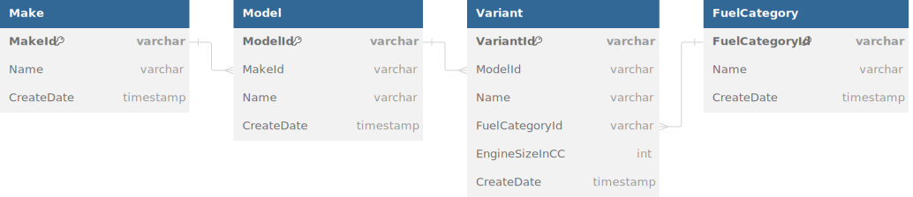

# VehicleTaxonomy.Azure

An example of a microservice that can be used to classify vehicles by make, model and variant. I have used this microservice to explore the Azure serverless stack, specifically:

- Functions
- CosmosDb
- Bicep

This example is also available in the following stacks:

- [AWS Serverless (Lambda, DynamoDb, SAM)](https://github.com/HeyJoel/VehicleTaxonomy.Aws) 

## Design Overview

### Domain Model

The taxonomy API will use a simplified hierarchy of classifications and only covers a single vehicle type (cars):

- **Make:** AKA Brand or Marque. The retail name of the company that produces a range of vehicle models. Note that a parent company may own a range of makes e.g. "Volkswagen", "Audi" and "Porche" are all makes owned by the "Volkswagen Group" organisation.
- **Model:** A model of vehicle often with a distinct shape and chassis e.g. for make "Volkswagen" modles could be "Polo", "ID.3", "Golf Plus" etc. A Make has many models, and a model can have many configurations or "variants".
- **Variant:** AKA derivative or configuration. A specific configuration of a vehicle model combining attributes such as the "trim" level, fuel type and engine size e.g. Volkswagen Polo variants include "POLO MATCH TDI 1.5l Diesel", "POLO S 1.2l Petrol" and "POLO S 75 AUTO 1.4l Petrol".

In addition we'll also capture some example attributes against a variant including the fuel type and engine size. This structure can be represented by the entity relationship diagram (ERD) below:



### API Design

The microservice will need to cover the following behavior for each of the three entities in the make-model-variant hierarchy:

- List all, by parent entity id if applicable
- Determine if a new entity meets uniqueness criteria i.e. an "is unique" query
- Add entity
- Delete entity

Additionally we'll need a way to bulk import taxonomy data via a CSV file.

### Import Data

As example data we'll be using [vehicle statistics data from the UK Government](https://www.gov.uk/government/collections/vehicles-statistics), available under the [open government licence v3](https://www.nationalarchives.gov.uk/doc/open-government-licence/version/3/). Here's an extract of the data:


An export of the data from 2024 can be found in the data directory at [/data/MakesModelsFuelType.csv](/data/MakesModelsFuelType.csv), which is around 6mb and has around 75,000 rows. Once imported the dataset would be expected to only grow slowly over time as new makes and models enter production. It is not expected that older data will need to be updated often or at all.

This data does not explicitly include a variant or derivative so we will need to construct one from the "Model", "Fuel" and "EngineSizeSimple" columns in the CSV. Confusingly, it will be the CSV "GenModel" value (AKA "Generation" Model) that we will use for our interpretation of a vehicle "Model", as this value best aligns with a customer expectations when, for example, filtering vehicle selection by model.

The dataset also include data for non-car vehicle types, but including this data is a non-goal. 

### Database Design: CosmosDb

I used DynamoDb in the original [AWS version of this example](https://github.com/HeyJoel/VehicleTaxonomy.Aws), and for CosmosDb many of the considerations are similar. [Choosing the correct partition scheme](https://learn.microsoft.com/en-us/azure/cosmos-db/partitioning-overview) is particularly important to avoid hot partitions as well as understanding [how to model a relational schema in nosql](https://learn.microsoft.com/en-us/azure/cosmos-db/nosql/modeling-data).

#### Vehicle Taxonomy Schema

For our vehicle taxonomy data we'll use a single-container design, overloading the container to store all our entity types. Here's a description of the data fields:

- **EntityType:** Used to determine the entity type in the overload cosmos db container e.g. "Make", "Model" or "Variant". This isn't used for querying and is only stored for debugging purposes.
- **Id:** The internal CosmosDb identifier for the entity, unique across all entity types. This is the full identity path (ParentPath plus PublicId), which is then hashed and encoded because the CosmosDb recommendation is for alpha-numerical values only.
- **ParentPath:** The hierarchical path to the entity using the public ids of parent entities. e.g. for a model this might be '/volkswagen', or for a variant this might be '/volkswagen/polo'. For makes this is always "/". This value is used as the partition key.
- **PublicId:** A slugified version of the name used as the public identifier for item, unique within the ParentPath e.g. "volkswagen", "3-series" or "se-petrol-1-3".
- **Name:** Publicly displayable name or title of the record e.g. "BMW" or "3 Series".
- **CreateDate:** The date the record was created in UTC.
- **VariantData:** Additional data fields relating only to "Variant" entities.

Points of note:

- Because the `id` is composed from the full path we can use it to determine uniqueness via point reads and enforce uniqueness during inserts.
- The `ParentPath` partition key can be used to efficiently return lists of makes as well as lists of models and variants filtered to their parent entity. The ordering of items is facilitated by an index on the `name` property.

Here's an example variant entry:

```json
{
    "entityType": "Variant",
    "id": "odalcqp34gotpvwjgwjyndwssu3cgcyxldwo5yh2bf6nhyn3dnfyzakj7h",
    "parentPath": "/alfa-romeo/alfa-romeo-159",
    "publicId": "159-jts-3-2l-petrol",
    "name": "159 JTS 3.2l Petrol",
    "createDate": "2024-09-06T15:56:58.5962699",
    "variantData": {
        "fuelCategory": "Petrol",
        "engineSizeInCC": 3200
    },
}
```

### API Endpoints: Functions

Currently there's two approaches to developing Azure Functions in .NET, ["in-process" and "isolated"](https://learn.microsoft.com/en-us/azure/azure-functions/dotnet-isolated-in-process-differences). In this example I'm using the isolated worker model because it is the recommended approach, with support for the in-process model ending in Nov 2024. The [Durable Functions](https://learn.microsoft.com/en-us/azure/azure-functions/durable/durable-functions-overview?tabs=in-process%2Cnodejs-v3%2Cv1-model&pivots=csharp) framework is used to handle the long running data import process. 

Auth is not covered by this example project so all API functions are set to allow anonymous access.

### Infrastructure as Code (IaC): Bicep

There are a number of IaC frameworks for getting Azure infrastructure deployed:

- [ARM Templates](https://learn.microsoft.com/en-us/azure/azure-resource-manager/templates/): Base-level framework for defining and provisioning Azure resources through JSON templates.
- [Bicep](https://learn.microsoft.com/en-us/azure/azure-resource-manager/bicep/overview/): A concise DSL that builds on top of ARM templates making them simpler and easier to work with. Only supports Azure resources.
- [Terraform](https://www.terraform.io/): Popular cross-platform IaC via configuration files (HCL). [OpenTofu](https://opentofu.org/) is an open source fork of Terraform.
- [Pulumi](https://www.pulumi.com/): Open source cross platform IaC using programming languages such as TypeScript and C#.

In this example we're only dealing with Azure resources so I've used Bicep.

## Local Development

### Prerequisits

- .NET 8 SDK
- Docker environment e.g. [Docker Desktop](https://qubitpi.github.io/docker-docs/get-docker/).

Tested on Visual Studio 2022 and Docker Desktop for Windows with WSL2, but other environments should be supported.

### Running the API

#### 1. Start local resources

First startup local resources via the docker compose file in the root of the repository:

```
docker compose -f docker-compose.dev.yml up
```

The local ComsosDb emulator can take a while to startup, so make sure you wait until it's done.

#### 2. Initialize local resources

TODO: init cosmos etc first time

#### 3. Configure Api project

Next configure the `VehicleTaxonomy.Azure.Api` project to connect to your local docker resources by [configuring your user secrets](https://learn.microsoft.com/en-us/aspnet/core/security/app-secrets?view=aspnetcore-8.0&tabs=windows#use-visual-studio) with the following settings:

```json
{
  "CosmosDb": {
    "ConnectionString": "AccountEndpoint=https://localhost:8081/;AccountKey=C2y6yDjf5/R+ob0N8A7Cgv30VRDJIWEHLM+4QDU5DE2nQ9nDuVTqobD4b8mGGyPMbIZnqyMsEcaGQy67XIw/Jw==",
    "UseLocalDb": true
  },
  "BlobStorage": {
    "ConnectionString": "DefaultEndpointsProtocol=http;AccountName=devstoreaccount1;AccountKey=Eby8vdM02xNOcqFlqUwJPLlmEtlCDXJ1OUzFT50uSRZ6IFsuFq2UVErCz4I6tq/K1SZFPTOtr/KBHBeksoGMGw==;BlobEndpoint=http://127.0.0.1:18080/devstoreaccount1;QueueEndpoint=http://127.0.0.1:18081/devstoreaccount1;TableEndpoint=http://127.0.0.1:18082/devstoreaccount1;"
  }
}
```

Note that the above keys are public, well known keys for the Azure emulators.

#### 4. Run Api project

Start up the `VehicleTaxonomy.Azure.Api` project. 

- Swagger API docs are available at `http://localhost:7177/api/swagger/ui`.
- The docker-based CosmosDb emulator GUI is available at `https://localhost:8081/_explorer/index.html`

### Running Tests

Many of the domain project tests run integrated with a local CosmosDb instance provided via [test containers](https://dotnet.testcontainers.org/) which is automatically regenerated for each test run. As long as you have a local docker runtime running you will be able to run the tests. Unfortunately the long bootup time of the CosmosDb emulator significantly delays the running of integration tests, so when running locally it's more performant to test against an long-lived emulator instance. You can do this using the same local development docker compose file:

```
docker compose -f docker-compose.dev.yml up
```

Then simply change the connection string in your `VehicleTaxonomy.Azure.Domain.Tests` project [user secrets](https://learn.microsoft.com/en-us/aspnet/core/security/app-secrets?view=aspnetcore-8.0&tabs=windows#use-visual-studio) configuration:

```json
{
  "CosmosDb": {
    "ConnectionString": "AccountEndpoint=https://localhost:8081/;AccountKey=C2y6yDjf5/R+ob0N8A7Cgv30VRDJIWEHLM+4QDU5DE2nQ9nDuVTqobD4b8mGGyPMbIZnqyMsEcaGQy67XIw/Jw==",
    "UseLocalDb": true
  }
}
```

Tests are run against a separate CosmosDb database, so there's no conflict with your local API development environment.

#### E2E tests

There are currently no tests for the `VehicleTaxonomy.Azure.Api` project due to [a lack of test server support in Azure Functions](https://github.com/Azure/azure-functions-dotnet-worker/issues/281). [Issue 1](https://github.com/HeyJoel/VehicleTaxonomy.Azure/issues/1) covers resolving this. 

## Deployment

### Deploying Infrastructure

Azure resources are deployed via [Bicep](https://learn.microsoft.com/en-us/azure/azure-resource-manager/bicep/overview/) using the files located in the [Infra](/infra) folder, see the [infra readme](/infra/README.md) for deployment instructions.

### Deploying the Functions App

Once the infrastructure is in place you can deploy the `VehicleTaxonomy.Azure.Api` functions project either via the [Visual Studio publish dialog](https://learn.microsoft.com/en-us/azure/azure-functions/functions-develop-vs?pivots=isolated#publish-to-azure) or via the command line with [Azure Functions Core Tools](https://learn.microsoft.com/en-us/azure/azure-functions/functions-run-local). No additional application configuration is required, it is all handled by the bicep files.

## API Docs

### Swagger/OpenApi docs

Swagger API docs are available at `/api/swagger/ui`.

### Bruno

> [Bruno](https://www.usebruno.com/) is an open source API client similar to postman, but does not require a login and saves API collections to your file system.

A [Bruno](https://www.usebruno.com/) API collection is available in the [/docs/api](/docs/api) folder, all you need to do is add a `baseUrl` environment variable for your functions deployment. 

